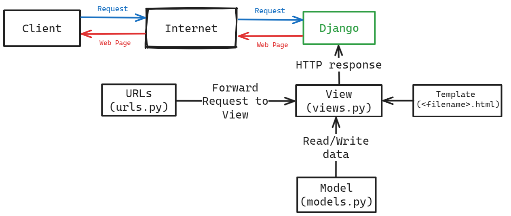

Nama : Joe Mathew Rusli
NPM : 2306152310
Kelas : PBP E

PBP E-Commerce

Open [http://127.0.0.1:8000](http://127.0.0.1:8000) with your browser to see the result.

Open this [link](http://joe-mathew-zeroecommerce.pbp.cs.ui.ac.id/) to see the result on PWS.
## Tugas 2
#### Jelaskan bagaimana cara kamu mengimplementasikan checklist di atas secara step-by-step (bukan hanya sekadar mengikuti tutorial).
1. Membuat project baru dengan menggunakan command `django-admin startproject zeroecommerce`
2. Membuat aplikasi baru dengan menggunakan command `python manage.py startapp main`
3. Membuat model untuk produk dengan isi sebagai berikut:
```python
    name : CharField
    price : IntegerField
    description : TextField
    stock : IntegerField
```
4. Membuat view untuk menampilkan list produk dengan menambahkan fungsi `show_main` di `views.py` di folder main
5. Membuat routing untuk aplikasi main dengan menambahkan path ke `urls.py` di folder main
6. Membuat routing yang mengarah ke main dengan menambahkan path ke `urls.py` di folder zeroecommerce

#### Buatlah bagan yang berisi request client ke web aplikasi berbasis Django beserta responnya dan jelaskan pada bagan tersebut kaitan antara `urls.py`, `views.py`, `models.py`, dan berkas `html`.


#### Jelaskan fungsi `git` dalam pengembangan perangkat lunak!
Git adalah sebuah sistem yang memungkinkan developers untuk berkolaborasi dalam pembuatan suatu program dengan cara mengelola versi dari program tersebut. Git memungkinkan developers untuk membuat branch baru, merge branch, dan melihat perubahan yang terjadi pada program. Dengan menggunakan git, developers dapat bekerja secara bersamaan tanpa mengalami konflik pada program yang sedang dikerjakan.

#### Menurut Anda, dari semua framework yang ada, mengapa framework Django dijadikan permulaan pembelajaran pengembangan perangkat lunak?
Django dijadikan permulaan pembelajaran pengembangan perangkat lunak karena Django memiliki dokumentasi yang lengkap dan mudah dipahami. Selain itu, Django juga memiliki fitur yang lengkap dan mudah digunakan sehingga memudahkan developers dalam membuat aplikasi web. Django juga memiliki fitur yang memungkinkan developers untuk membuat aplikasi web dengan cepat dan efisien.

#### Mengapa model pada Django disebut sebagai ORM?
Model pada Django disebut sebagai ORM (Object-Relational Mapping) karena model pada Django memungkinkan developers untuk berinteraksi dengan database menggunakan objek-objek Python. Dengan menggunakan model pada Django, developers dapat membuat, membaca, mengubah, dan menghapus data pada database menggunakan objek-objek Python tanpa perlu menulis query SQL secara langsung.